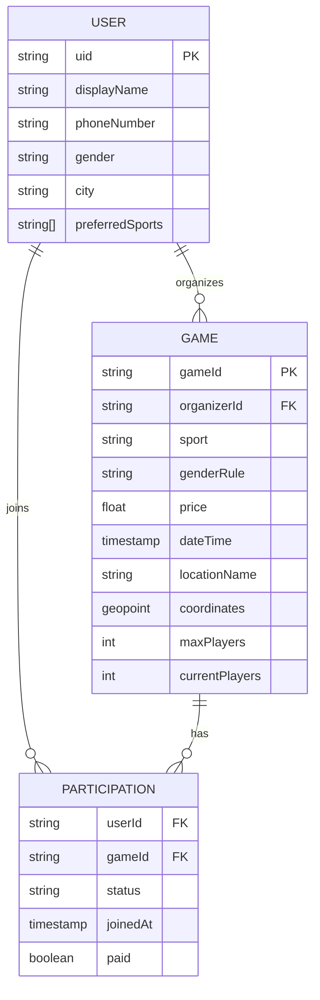

# System Architecture

## Overview
The LA3IB Web App uses a **serverless architecture** leveraging **Firebase** for backend services and domain logic. The frontend is built with **Flutter Web**, utilizing **Riverpod** for state management and **GoRouter** for navigation.

## Architecture Diagram

```mermaid
graph TD
    subgraph Client [Flutter Web Client]
        UI[UI Layer (Screens & Widgets)]
        Controllers[Controller Layer (Riverpod Notifiers)]
        Repos[Repository Layer (Data Access)]
        
        UI --> Controllers
        Controllers --> Repos
    end

    subgraph Backend [Firebase Services]
        Auth[Firebase Auth]
        Firestore[(Cloud Firestore)]
        Storage[(Firebase Storage)]
        FCM[Cloud Messaging]
    end

    Repos -- "Auth (Google/Email)" --> Auth
    Repos -- "Read/Write Documents" --> Firestore
    Repos -- "Upload Images" --> Storage
    FCM -- "Push Notifications" --> Client

    subgraph Data_Models [Firestore Collections]
        Users[users/{userId}]
        Games[games/{gameId}]
        Bookings[games/{gameId}/participants/{userId}]
    end

    Firestore -.-> Users
    Firestore -.-> Games
    Firestore -.-> Bookings
```

## Data Flow
1.  **Authentication**:
    *   User signs in via Google or Email/Password.
    *   Firebase Auth returns a JWT token.
    *   App checks `users/{userId}` to authorize or redirect to Onboarding.

2.  **Game Creation**:
    *   Organizer submits form.
    *   Game data written to `games` collection.

3.  **Discovery (Read Path)**:
    *   Home screen queries `games` collection.
    *   Filters applied via Firestore `where` clauses (e.g., `where('sport', '==', 'Football')`).

4.  **Joining (Write Path)**:
    *   User clicks "Join".
    *   Transaction:
        1.  Read generic `game` doc to check `currentPlayers < maxPlayers`.
        2.  Write to `games/{gameId}/participants/{userId}`.
        3.  Increment `currentPlayers` on game doc.

## Tech Stack
*   **Frontend**: Flutter 3.x (Web)
*   **State Management**: Riverpod (Generator)
*   **Routing**: GoRouter
*   **Backend**: Firebase (Auth, Firestore, Cloud Functions - opt)
*   **Maps**: Google Maps Flutter / Mapbox

## Data Model (ER Diagram)


