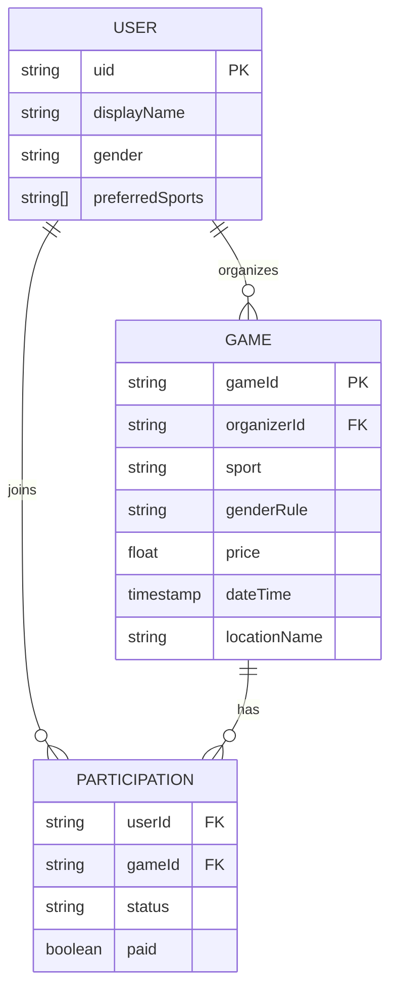

# System Architecture & Data Model

## System Architecture
```mermaid
graph TD
    subgraph Client [Flutter Web Client]
        UI[UI Layer (Screens & Widgets)]
        Controllers[Controller Layer (Riverpod Notifiers)]
        Repos[Repository Layer (Data Access)]
        
        UI --> Controllers
        Controllers --> Repos
    end

    subgraph Backend [Firebase Services]
        Auth[Firebase Auth]
        Firestore[(Cloud Firestore)]
        Storage[(Firebase Storage)]
        FCM[Cloud Messaging]
    end

    Repos -- "Auth (Google/Email)" --> Auth
    Repos -- "Read / Write" --> Firestore
    Repos -- "Upload Media" --> Storage
    FCM -- "Push Notifications" --> Client
```

## Entity Relationship Diagram (ERD)


