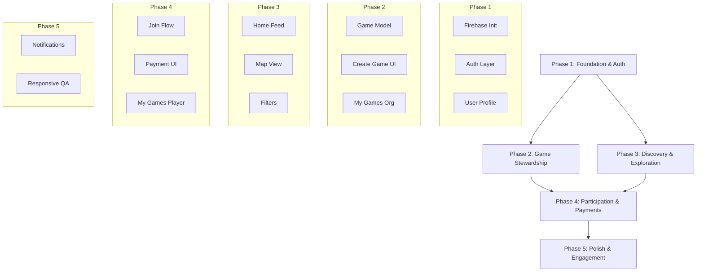

# MVP Phased Implementation Plan

Based on the MVP Scope and Screens, here is the implementation roadmap broken down into 5 distinct phases.

## Phase 1: Foundation & Authentication (User & Identity)
**Goal:** specific Users can sign up, sign in, and manage their basic profile.
- [ ] **Firebase Setup**: Initialize Firebase project (Auth, Firestore).
- [ ] **Authentication Layer**:
    -   Implement `AuthRepository` with Riverpod.
    -   **Google Sign-In** integration.
    -   **Email/Password** Sign-In & Sign-Up screens.
- [ ] **User Profile**:
    -   Firestore `users` collection schema.
    -   Onboarding Screen: Name, Gender, City, Preferred Sports.
    -   Profile Screen (Read/Edit).
- [ ] **Routing**: Auth state listening to redirect generic users to Onboarding/Home.

## Phase 2: Game Stewardship (Organizer Side)
**Goal:** Users can create games and view them in their management list.
- [ ] **Data Model**: Define `Game` model and Firestore schema.
- [ ] **Create Game Screen**:
    -   Form validation (Sport, Gender, Max Players, Price, Time, Location).
    -   Date/Time picker integration.
    -   Location picker (Text first, then Map integration).
- [ ] **Firestore Service**: Create CRUD methods for games.
- [ ] **My Games (Organizer View)**:
    -   List games created by the current user.
    -   Delete/Cancel game options.

## Phase 3: Discovery & Exploration (Player Side)
**Goal:** Users can find relevant games to play.
- [ ] **Home Screen**:
    -   Fetch approved/open games from Firestore.
    -   **List View**: Game Cards (Sport Icon, Date, Location, Price, Slots).
- [ ] **Map View** (Bonus/Parallel):
    -   Display games pins on a map (Google Maps or Mapbox).
- [ ] **Filtering**:
    -   Filter by Sport, Gender, Date.
    -   Local state management for active filters.
- [ ] **Game Details Screen**:
    -   Full game info presentation.
    -   Show current participant count.

## Phase 4: Participation & Payments
**Goal:** Users can join games and pay entry fees.
- [ ] **Join Flow**:
    -   "Join Game" CTA logic.
    -   Check slot availability (Firestore Transaction).
- [ ] **Payment Integration**:
    -   Payment UI (Card input / Mock for MVP).
    -   *Note: Actual gateway integration depends on provider choice, placeholder for MVP.*
- [ ] **My Games (Player View)**:
    -   Show "Joined" games separate from "Created" games.
- [ ] **Security Rules**: Ensure only participants/owners can see sensitive info.

## Phase 5: Polish & Engagement
**Goal:** Notifications and responsive behavior.
- [ ] **Notifications**:
    -   Setup Firebase Cloud Messaging (FCM).
    -   Trigger notifications (Game Created, User Joined - via Cloud Functions or Client trigger).
- [ ] **Responsive Polish**:
    -   Verify mobile-first layout on desktop sizes (using `ResponsiveCenter`).
- [ ] **Final QA**:
    -   End-to-end testing of user flows.

## MVP Implementation Roadmap

