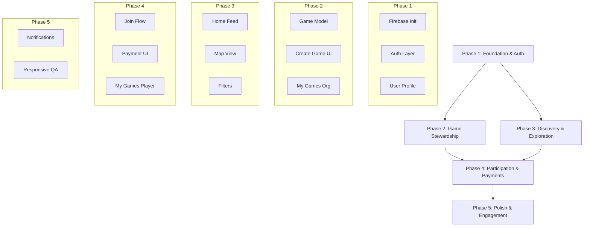

# MVP Implementation Roadmap

```mermaid
graph TD
    P1[Phase 1: Foundation & Auth] --> P2[Phase 2: Game Stewardship]
    P1 --> P3[Phase 3: Discovery & Exploration]
    P2 --> P4[Phase 4: Participation & Payments]
    P3 --> P4
    P4 --> P5[Phase 5: Polish & Engagement]

    subgraph Phase 1
    P1_1[Firebase Init]
    P1_2[Auth Layer]
    P1_3[User Profile]
    end

    subgraph Phase 2
    P2_1[Game Model]
    P2_2[Create Game UI]
    P2_3[My Games Org]
    end

    subgraph Phase 3
    P3_1[Home Feed]
    P3_2[Map View]
    P3_3[Filters]
    end

    subgraph Phase 4
    P4_1[Join Flow]
    P4_2[Payment UI]
    P4_3[My Games Player]
    end

    subgraph Phase 5
    P5_1[Notifications]
    P5_2[Responsive QA]
    end
```

